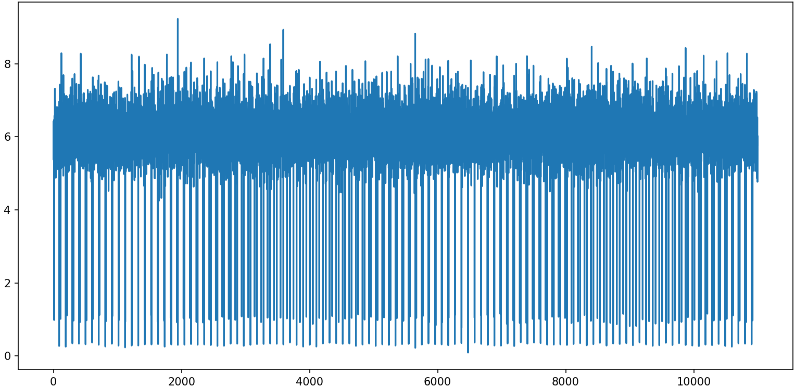
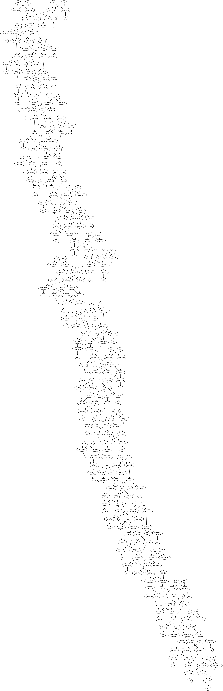

# advent-of-code-2024

My solutions to the [advent of code 2024 puzzles](https://adventofcode.com/2024), lets see how this goes!

## Notes
### Day 5
Used bubble sort - a more efficient method would have been possible but the compute time was still very small.

### Day 6
Extremely slow performance in part 2 due to copying the entire grid each time the guard moved.
Regression test not sensible due to performance.
Improvements could have made:
- Store the Area as an (x, y) size, with obstacles and places visited stored as sets of coordinates.
- Find the closest obstacle in the direction the guard is facing, and move immediately there, rather than single steps
  - Note: stepping through 1 space at a time still required for finding shortlist of all the potential obstacle locations for part 2

### Day 7
2^x possible answers for x parameters in the equation didn't seem crazy for part 1,
especially with the max parameters per equation being 12 giving a measly 4096 checks to make.
So, taking a "you ain't gonna need it" approach, got a brute force approach working which was easy to modify for part 2.

But for part 2, up to 531441 calculations would be needed per equation using the brute force,
and the solution did take ~50s to solve using this method.
With some time left, I managed to use tree logic to discount many of the possibilities much earlier in the checking process.
This reduced time from ~50s to under 0.1s.

Todo: look at the big-o notation - probably interesting here.

### Day 8
Good handling of the grid after the learning from day 6
(i.e. just storing the locations of the important items rather than storing the value for each cell in the grid)
helped the solver run very quickly, and a nice `print_grid()` function taking this storage of the grid as inputs still allowed easy debugging.

### Day 11
Sometimes the only way to work out what trap has been set… is to walk into it.
Brute force part 1 approach predictably got punished, 
but by a simple tripling of the number of iterations it needed to run for rather than any changing of the rules.

By the final iteration of part 2, keeping track of duplicated values together (i.e. with a value and count rather than just a list of values) 
reduced the amount of calculations by a factor of 40 billion, which is a reduction of 180 trillion calculations per cycle!

### Day 13
Vectors! Unless the vectors are parallel, there's only one solution. 
A nice dataclass with some of the dunder methods like `__add__` defined helped.
Could have utilised vector package on pypi alternatively.

The twist for part b wasn't expected, and led to a big re-write and deeper dive into vector calculations.

### Day 14
Spent too long on part 2 - thought the tree would be symmetric, so spent a while checking for symmetry.
Solved quickly the next morning by assuming that the robots would all be grouped together when the tree is formed,
so the product of the number of robots in each sub-area of the grid would be smaller.
A plot showed a potential candidate (the one with the very lowest value on the y axis), which turned out to be correct:


### Day 15
Nothing too clever here, but a gif of some of part 2:


### Day 16 
Wow, part 1 was hard for me, until I learnt about Dijkstra's algorithm.

I started with a (naive, in hindsight) Depth First Search using a recursive function. 
That ran into complexities, so used a Breadth First Search, but looped through routes rather than dequeueing by cost.
That successfully solved all the tests I could throw at it, and found valid paths in the real input,
but, despite much bug chasing, failed (crucially) to find the shortest one. Its downfall was its complexity.
Finally, some internet searching helped get an implementation of Dijkstra's algo working, dequeueing by current cost.

The struggle with debugging led to introducing logging to allow debug printing to be turned on and off easily.

Part 2 was a nice, relatively simple addition, after the initial algorithm was done. 
Caching keeps the part 1 and part 2 functions neatly separated, whilst enabling tests to run more quickly.

### Day 17
Part 1 easy. Tried OOP, because why not.
Solves in O(n) where n is program length.

Part 2:
Brute force would have been O(n^n). 
Analysing the program allowed a solution to be found in O(n),
though in a way that's less generalisable to other programs.

Notes:
- Program is 8 instructions long (so 16 digits) and outputs once per loop
  - This output is 'B' modulo 8, so it's last 3 bits of 'B' (instruction 7)
- Program ends when 'A' equals 0
- Only one jump each loop - from the end to the start (instruction 8)
- 'A' gets divided by 8 each loop (flooring the result), and is otherwise untouched (instruction 6), 
 and 8^y in binary is 100000... (with 3*y trailing 0s)
  - This divide by 8 effectively removes the last 3 bits from the number in 'A'
  - So 8^15 < 'A' < 8^16 for output length to be 16 (i.e. length of the program)
    - Confirmed by running different input values for A for part 1 code
    - This means we could brute force, solving in O(n^n) where n is equal to program length 
  - This also means running the program with 0 < 'A' < 8 must output the last digit in the program,
and that adding and preceding binary digits won't affect the final digit ouput.
    - Then adding 3 preceding binary digits and running 1 loop must output the second last digit in the program, etc
  - This can be used to solve in O(n)

### Day 19
Started with a recursive depth first search for part 1, 
then tried a looped breadth first search for part 2 as we had to cover all possibilities,
before realising that depth first was still going to be simpler, so changing the recursive search from p1.

### Day 24
We need to swap 4 pairs in a list of ~200 logic gates. Blindly trying all the options would be O(n^8) where n is the number of logic gates.
Just to see what we were working with, I calculated the combinations of 4 different pairs from the ~200.
My laptop melted just turning the combinations iterator into a list, so pure brute force didn't bode well.

I had two ideas:
1. Just make a plot of the circuit diagram and see if it's regular enough to be able to visually check what's wrong.
If it was an optimised adder, it would be regular, but AOC being tricksy there was a chance it was just spaghetti.
This is totally manual, so is O(n^_human-speed_).

2. In a binary adder of x and y, a digit in the result only depends on the digits in x and y that are in the same spot or further to the right.
This means that we could swap one of each possible pair, and then test the resulting system with a bunch of carefully crafted test inputs,
and the result which has the most digits from the RHS correct (taking the minimum score across the test inputs) would be the correct swap.
Once the first correct swap is found, the next swap can be found, and so on.
If multiple swaps give the same score, we could continue analysing both of them.

    This will fall down if there are many swaps, but the puzzle states that there are only 4 swaps.
    This is O(n^2) and as there are 24531 different pairs which can be swapped, this means looping through ~100,000 different logic circuits in total.

I tried option 2 first. It worked well, once the test x and y samples were tuned, but took ~30 mins to complete.
I did option 1 in the meantime - which turned out to be much easier for solving the puzzle just once as the circuit is very regular.

Seeing that the logic circuit is indeed very regular,
an algorithm with some careful analysis of each logic gate and its connections to could reduce the algorithm to O(n).

Original circuit diagram:


### Random thoughts
- Some lessons in "you ain't gonna need it" when doing part 1.
Spent time optimising in areas that, in the end, weren't useful for part 2.
- Definitely learnt how to handle grids more efficiently...

## Setup
Using poetry for package management.
```shell
poetry install
```

## Use
One file per day, to be run as a script.
Run with, for example:
```shell
poetry run python advent_of_code/day_1.py
```

To include debug and/or info logging statements (where available), use flag `-v` or `-vv`.

## Lint
```shell
bin/list.ps1
```

## Tests
Starting from when it got more complex, tests added to prevent regression.
Prior to this, assertions are added after solution is found to allow safe refactoring.
```shell
poetry run pytest
```
